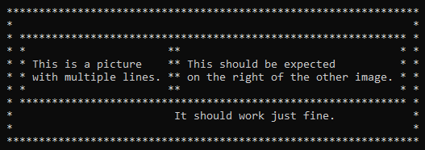

# Character Picture
This project is based on the Character Pictures proposed in 
Accelerated C++ by A. Koenig and B. Moo. The goal is create an object
oriented character picture generator that allows the positioning 
of characters with frames and allow for vertical/horizontal concatenation.

## Background
This project was written as part of an ongoing effort to take on different challenges to teach how to program in
modern C++. This, in part, is also a learning experience for me as I grew up with legacy C++, pointers and what not.
Don't take my word as the de facto way of doing stuff.

Feel free to use the code or make it better by submitting pull requests. I'm always looking to be a better 
programmer and engineer, and I hope these projects can help you too.

## Programming Topics
- Object Oriented Programming
  - Inheritance
  - Polymorphism
- Standard Template Library
  - Shared pointers
  - Custom output to ostream
  
## References
A. Koenig and B. Moo, (2000), *Accelerated C++ Practical Programming By Example*, 
Addison Wesley, Boston.
